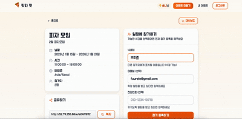

# 🍕 핏자 팟 (Pizza Pot)

> 모임 일정 조율을 쉽고 빠르게! 친구들과 함께 최적의 시간을 찾아보세요.

<p align="center">
  
  
  
  
  
</p>

---

## 📌 프로젝트 소개

**핏자 팟**은 여러 사람의 일정을 조율할 때 겪는 불편함을 해결하기 위해 만든 서비스입니다.

카카오톡 투표나 엑셀 대신, 링크 하나로 모두의 가능한 시간을 수집하고 최적의 시간을 추천받을 수 있습니다.

### ✨ 주요 기능

| 기능 | 설명 |
|------|------|
| 📅 **이벤트 생성** | 날짜/시간 범위를 설정하여 일정 조율 시작 |
| 👥 **익명 참가** | 회원가입 없이 링크만으로 참가 가능 |
| 🔥 **히트맵 시각화** | 참가자들의 가능 시간을 한눈에 확인 |
| ⏰ **최적 시간 추천** | 가장 많은 사람이 가능한 시간 자동 추천 |
| 📧 **이메일 알림** | 일정 확정 시 참가자에게 이메일 발송 |
| 📱 **SMS 알림** | Solapi 연동으로 문자 알림 발송 |
| 💬 **카카오톡 공유** | 카카오톡으로 이벤트 링크 쉽게 공유 |
| 📆 **캘린더 연동** | ICS 파일 다운로드로 캘린더 추가 |

---

## 🛠 기술 스택

### Backend
- **Framework**: Django 4.2 + Django REST Framework
- **Database**: PostgreSQL 15
- **Cache/Broker**: Redis 7
- **Task Queue**: Celery 5.3
- **Authentication**: JWT (httpOnly Cookie)

### Frontend
- **Framework**: Next.js 14.2 (App Router)
- **Language**: TypeScript
- **Styling**: Tailwind CSS
- **State**: Zustand
- **Form**: React Hook Form + Zod

### Infrastructure
- **Server**: AWS EC2 (Amazon Linux 2023)
- **Web Server**: Nginx (Reverse Proxy)
- **Process Manager**: systemd

### External Services
- **Email**: Django SMTP (Gmail)
- **SMS**: Solapi API
- **Share**: Kakao JavaScript SDK

---

## 🏗 시스템 아키텍처

```
┌─────────────┐     ┌─────────────┐     ┌─────────────┐
│   Client    │────▶│    Nginx    │────▶│  Next.js    │
│  (Browser)  │     │   (Proxy)   │     │  (Port 3000)│
└─────────────┘     └──────┬──────┘     └─────────────┘
                           │
                           ▼
                    ┌─────────────┐     ┌─────────────┐
                    │   Django    │────▶│ PostgreSQL  │
                    │ (Port 8000) │     │             │
                    └──────┬──────┘     └─────────────┘
                           │
                           ▼
                    ┌─────────────┐     ┌─────────────┐
                    │   Celery    │────▶│    Redis    │
                    │  (Worker)   │     │   (Broker)  │
                    └─────────────┘     └─────────────┘
```

---

## 🚀 로컬 개발 환경 설정

### 사전 요구사항
- Python 3.9+
- Node.js 18+
- PostgreSQL 15+
- Redis 7+

### Backend 설정

```bash
# 가상환경 생성 및 활성화
python -m venv venv
source venv/bin/activate  # Windows: venv\Scripts\activate

# 의존성 설치
pip install -r requirements.txt

# 환경변수 설정
cp .env.example .env
# .env 파일 수정

# 데이터베이스 마이그레이션
python manage.py migrate

# 개발 서버 실행
python manage.py runserver
```

### Frontend 설정

```bash
cd frontend

# 의존성 설치
npm install

# 환경변수 설정
cp .env.example .env.local
# .env.local 파일 수정

# 개발 서버 실행
npm run dev
```

### Celery 실행 (별도 터미널)

```bash
celery -A config worker -l INFO
```

---

## 📁 프로젝트 구조

```
pizza/
├── apps/
│   ├── accounts/          # 사용자 인증
│   ├── events/            # 이벤트 관리
│   ├── participants/      # 참가자 관리
│   └── availability/      # 가용 시간 관리
├── config/
│   ├── settings/
│   │   ├── base.py        # 공통 설정
│   │   ├── local.py       # 로컬 설정
│   │   └── production.py  # 운영 설정
│   ├── celery.py          # Celery 설정
│   └── urls.py            # URL 라우팅
├── frontend/
│   ├── app/               # Next.js App Router
│   ├── components/        # React 컴포넌트
│   ├── lib/               # 유틸리티, API
│   └── types/             # TypeScript 타입
└── requirements.txt
```

---

## 🔐 환경변수 설정

### Backend (.env)

```env
# Django
SECRET_KEY=your-secret-key
DEBUG=True
ALLOWED_HOSTS=localhost,127.0.0.1

# Database
DB_NAME=pizza_db
DB_USER=postgres
DB_PASSWORD=your-password
DB_HOST=localhost
DB_PORT=5432

# Redis
REDIS_URL=redis://localhost:6379/0

# Email
EMAIL_HOST_USER=your-email@gmail.com
EMAIL_HOST_PASSWORD=your-app-password

# SMS (Solapi)
SOLAPI_API_KEY=your-api-key
SOLAPI_API_SECRET=your-api-secret
SOLAPI_SENDER_NUMBER=01012345678

# Frontend URL
FRONTEND_URL=http://localhost:3000
```

### Frontend (.env.local)

```env
NEXT_PUBLIC_API_URL=http://localhost:8000
NEXT_PUBLIC_FRONTEND_URL=http://localhost:3000
NEXT_PUBLIC_KAKAO_JAVASCRIPT_KEY=your-kakao-key
```

---

## 🐛 트러블슈팅

개발 과정에서 겪은 주요 이슈와 해결 방법입니다.

<details>
<summary><b>PostgreSQL 인증 오류</b></summary>

**에러**: `ident authentication failed for user`

**해결**: `/var/lib/pgsql/data/pg_hba.conf` 파일에서 인증 방식을 `ident` → `md5`로 변경
```
local   all   all   md5
host    all   all   127.0.0.1/32   md5
```
</details>

<details>
<summary><b>401 Unauthorized (JWT 쿠키 인증)</b></summary>

**원인**: HTTP 환경에서 `Secure` 쿠키가 전송되지 않음

**해결**: `USE_HTTPS` 환경변수로 분기 처리
```python
USE_HTTPS = os.environ.get('USE_HTTPS', 'False').lower() == 'true'
SECURE_SSL_REDIRECT = USE_HTTPS
SESSION_COOKIE_SECURE = USE_HTTPS
```
</details>

<details>
<summary><b>카카오톡 공유 버튼 비활성화</b></summary>

**원인**: Kakao SDK가 비동기(async)로 로드되어 useEffect 실행 시점에 미로드

**해결**: Polling 방식으로 SDK 로드 대기
```typescript
const interval = setInterval(() => {
  if (window.Kakao && !window.Kakao.isInitialized()) {
    window.Kakao.init(kakaoKey);
    setKakaoReady(true);
    clearInterval(interval);
  }
}, 100);
```
</details>

<details>
<summary><b>SMS 발송 실패 - IP 미허용</b></summary>

**에러**: `허용되지 않은 IP로 접근하고 있습니다`

**해결**: Solapi 콘솔에서 EC2 서버 IP를 화이트리스트에 추가
</details>

<details>
<summary><b>환경변수 미적용 (앞에 공백)</b></summary>

**원인**: `.env` 파일에서 변수 앞에 공백이 있으면 인식 안됨
```
  SOLAPI_API_KEY=xxx  # ← 앞에 공백 있음
```

**해결**: `sed -i 's/^[[:space:]]*//' .env`
</details>

---

## 📸 실행 화면

### 메인 페이지


### 이벤트 생성


### 시간 선택


### 대시보드


### 최종 시간 선택


---

## 👩‍💻 개발자

- **소민** - [GitHub](https://github.com/somineda)


